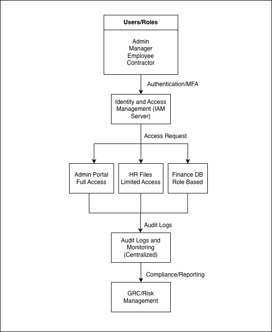

# Zero Trust IAM & GRC Program

## Overview
This project demonstrates a Zero Trust Identity and Access Management (IAM) system combined with Governance, Risk, and Compliance (GRC) practices. It simulates real-world access control, logging, and audit processes.

## Key Features
- Role-Based Access Control (RBAC)
- Multi-Factor Authentication (MFA)
- Access Control Matrix
- Audit Logging and Monitoring
- Risk Register and Compliance Checklist

## Architecture

*Figure 1: Zero Trust IAM & GRC Architecture Overview*

## Implementation
- Python script generates user access logs
- Audit script summarizes access activity
- Logs stored and analyzed for compliance monitoring

## GRC Components
- HIPAA Compliance Checklist
- Risk Register
- Security Policies

## Project Structure
zero-trust-iam-grc-program/
├── implementation/
│   ├── scripts/       # Python scripts for audit & logging
│   ├── screenshots/   # Screenshots for documentation
│   └── audit/         # Audit summaries
│       └── [audit_summary.md](implementation/audit/audit_summary.md)
├── architecture/      # Access control matrix & diagrams
│   └── [access_control_matrix.md](architecture/access_control_matrix.md)
├── compliance/        # HIPAA and other compliance checklists
│   └── [hipaa_compliance_checklist.md](compliance/hipaa_compliance_checklist.md)
├── policies/          # Security and usage policies
│   └── [password_policy.md](policies/password_policy.md)
├── risk-register/     # Risk register files
│   └── [risk_register.md](risk-register/sample-risk-register.md)
├── logs/              # Raw log files
└── README.md

## Tools Used
- Python
- Git & GitHub
- VS Code

## Author
Miguel Carrillo
